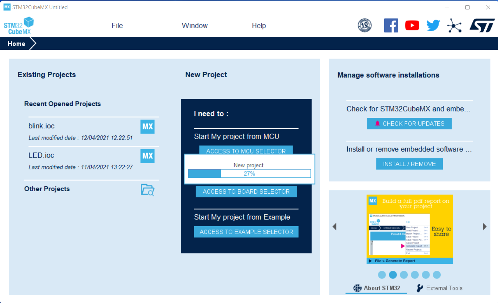
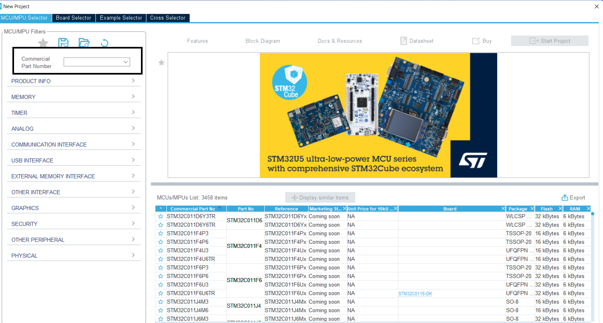
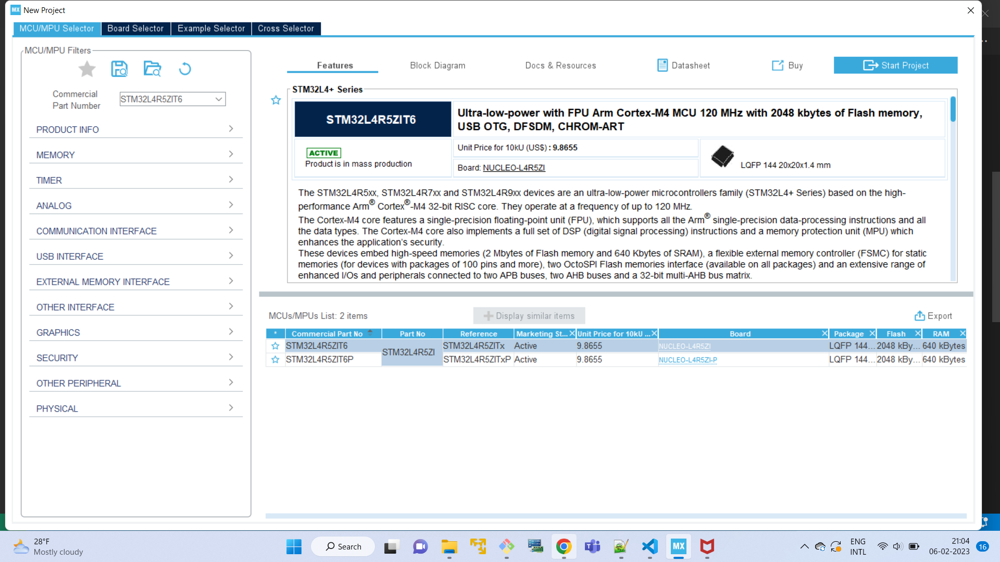
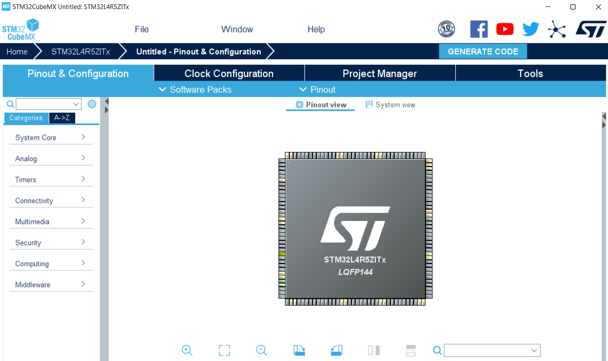
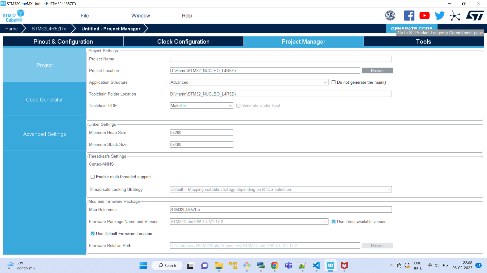
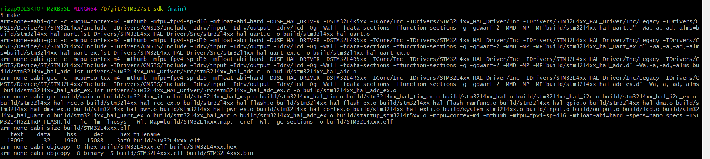
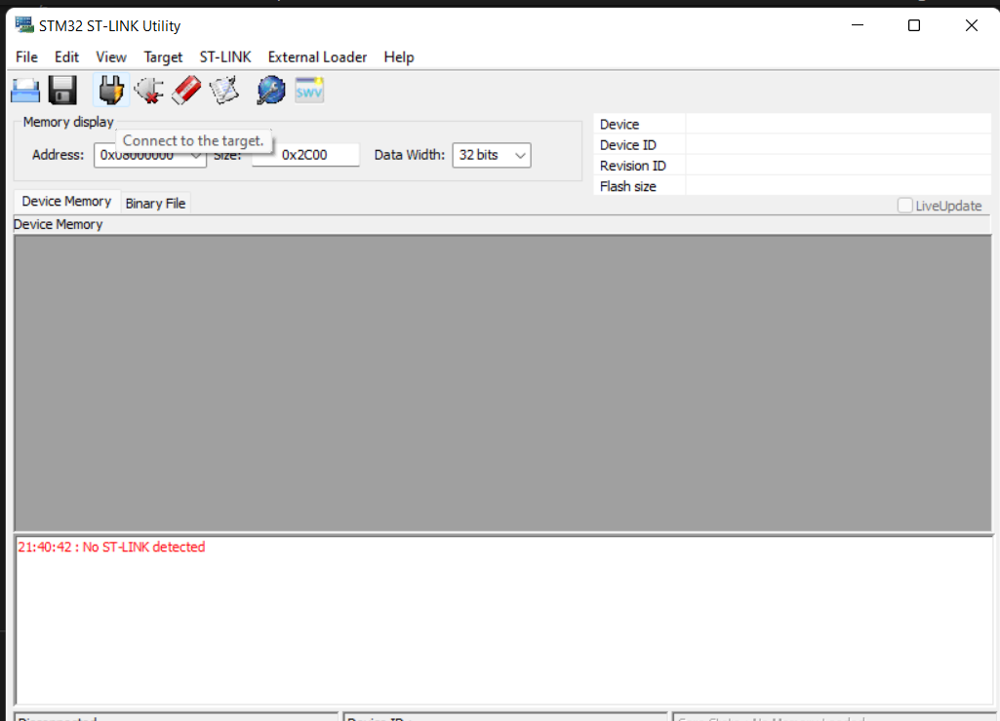
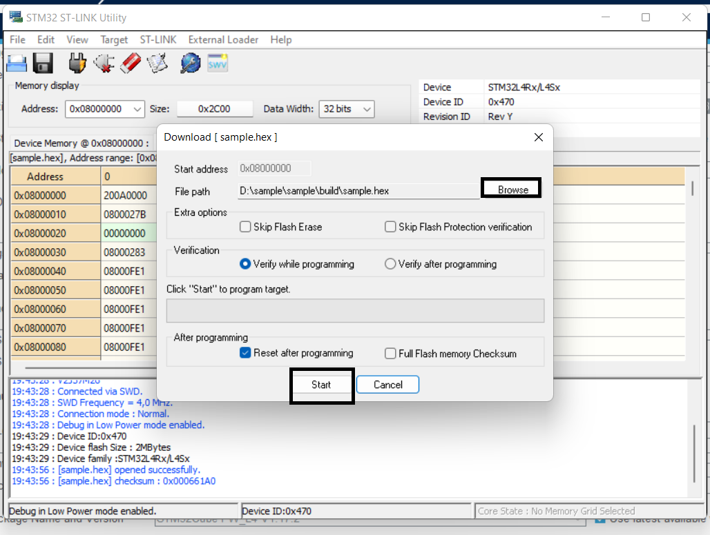

# STM32-nucleo board bring up

## Introduction

- Generate a source code for `STM32L4R5ZI` using `STM32CubeMx`
- Build the source code in order to get the hexfile.
- Flash the hexfile on `STM32L4R5ZI` using `STM32 utility`

## Procedures
- Open `STM32CubeMX` software.
  

- Select `file->New Project` that will create a new project
  as shown in figure.
  

- Please enter the commercial part number. Example: `STM32L4R5ZIT6`

- Press `Start project` that shows the `pinout and configuration` of the board as shown in the figure.
   

- Press the tab `Project Manager`, fill the `Project seetings` and make sure that you have selected the `Toolchain` as `Makefile`

- Click `Generate code` that will generate a code at the select path before.

- Make sure that you installed the `make` and `Embedded Arm GNU tool chain` (https://developer.arm.com/downloads/-/gnu-rm) on your PC.

- Build and generate a hex file by using `make`

  

- Connect `STM32-nucleo` board to the computer. Open `STM32 ST-LINK utility`  and Press `connect to the target`. Then select the hexfile which we build before.
  

  - Press `start` that will flash the hexfile into the    STM32 nuclo board.
   
