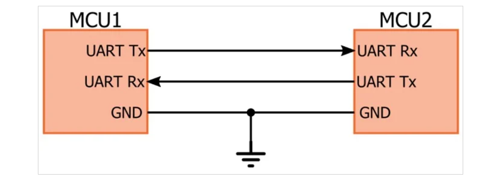
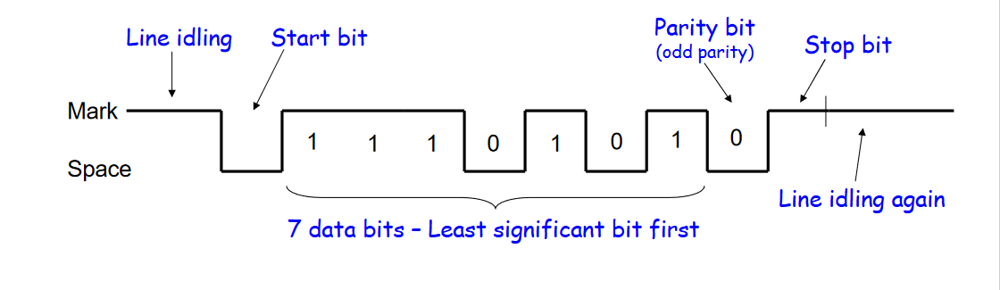
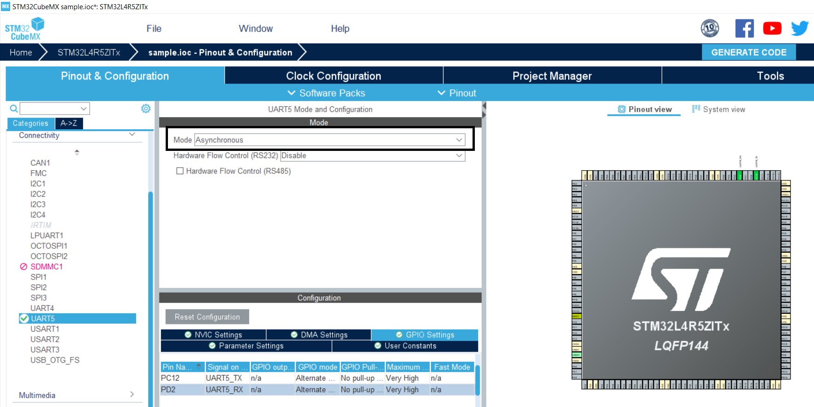
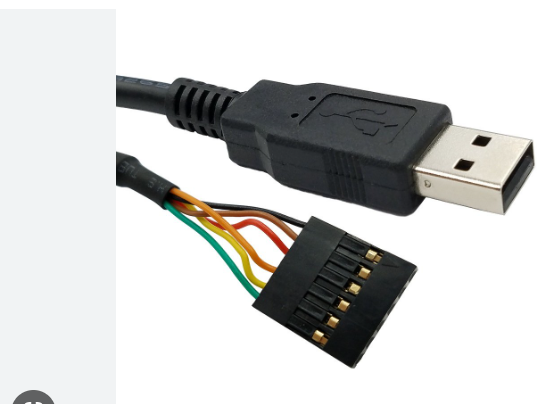

# UART - Universal Asynchronous Receiver/Transmitter

## Introduction  
1. General description about `UART`.  
2. Generate a code for UART using `STM32CubeMX`.  
3. Test the `UART` transmission using `Putty`.

## 1. General description about `UART`
- It is device-to-device communication and for asynchronously exchanging the serial data between two devices.
- Each UART device has two pin (Tx and RX).
- Device1 Tx pin should connect with Device2 Rx pin in order to transmit the data between the dvices as shown in the following figure.
- Data can be transmitted bit by bit.




## UART Data Transmission

- `Start bit`: To transmit the data, the transmiting UART pulls the transmission line (START BIT) from HIGH to LOW then the receiving UART detects the LOW and its begin to read the bits in the data frame

- `Data Frame`: It can be 5 to 8 bits long if the parity bits is used otherwise it can be 9 bit long.

- `Parity`: This bit is optional and it used for error detection. Parity bit either 0 (total number of 1s in the frame is odd) or 1 (total number of 1s in the frame is even).

- `Stop bit`: To end the transmission. The transmitting device pulls the pin from LOW to HIGH.

- `Baud rate`: Baud rate is a measure of the speed of data transfer expressed in bits per second.

- `Example`: To send the charactor `W`  (`0x57 : 0101 0111` )

    7-bit ASCII `W` (0x57) = 1 0 1 0 1 1 1  
    LSB order ( Data Frame) = 1 1 1 0 1 0 1

    Data is transmitter as LSB order, so complete transmission as below,
```
Start(0) + Data Frame(1 1 1 0 1 0 1) + Parity(0) + Stop(0)
```
   

## Reference

1. https://www.rohde-schwarz.com/se/products/test-and-measurement/oscilloscopes/educational-content/understanding-uart_254524.html
2. https://www.analog.com/en/analog-dialogue/articles/uart-a-hardware-communication-protocol.html

3. https://www.seeedstudio.com/blog/2022/09/08/uart-communication-protocol-and-how-it-works/

## 2. Generate a code for UART using `STM32CubeMX`

- Open `STM32CubeMX` software.

- In connectivity `select UART5`, in mode `select Asynchronous`.
- The Tx pin (PC12) and Rx Pin (PD2).
- Set the baud rate (By deafult 115200)
- Click `Generate code` that will generate a source code for UART.

  

- Following functios are used for UART transmission.
```
// Initializes UART (PC12 as Tx and PD2 as RX)
MX_UART4_Init()

// To transmit the data
HAL_StatusTypeDef HAL_UART_Transmit(UART_HandleTypeDef *huart, 
                                    const uint8_t *pData,
                                    uint16_t Size,
                                    uint32_t Timeout)
// To receive the data
HAL_StatusTypeDef HAL_UART_Receive(UART_HandleTypeDef *huart,
                                   uint8_t *pData,
                                   uint16_t Size,
                                   uint32_t Timeout)

```

## 3.Test the `UART` transmission using `Putty`.
- Connect the STM32 PC12 to FTDI Rx (yellow) and  STM32 PD2 to FTDI Tx(Orange).
- Connect the FTDI USB to PC and open the Putty
- In putty, select `Serial`, set baud rate and serial line then clock OK.
- Power on STM32
- We can see the transmitted data from STM32 on Putty.
 
 