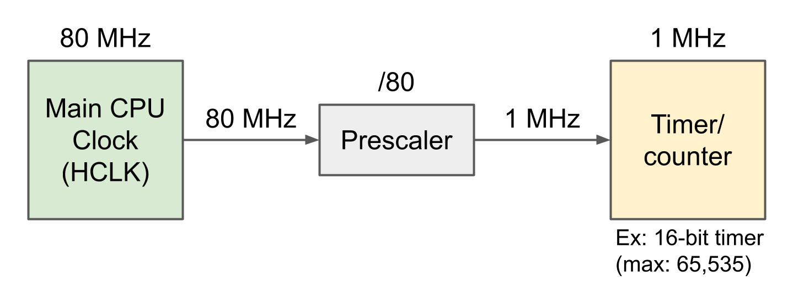
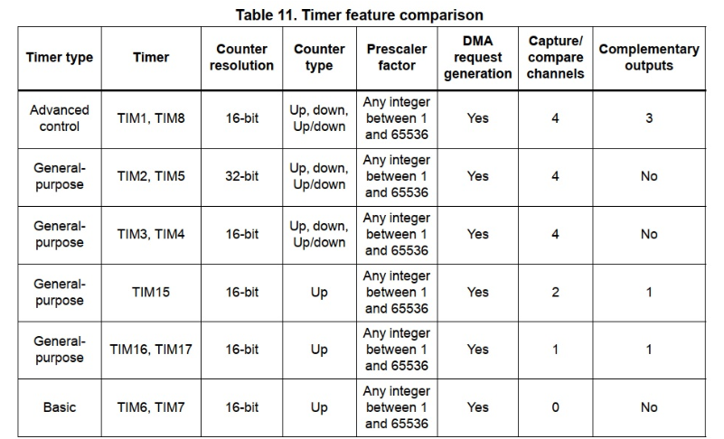
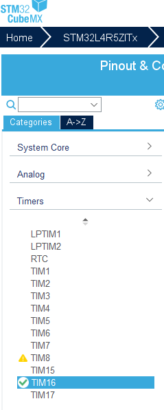
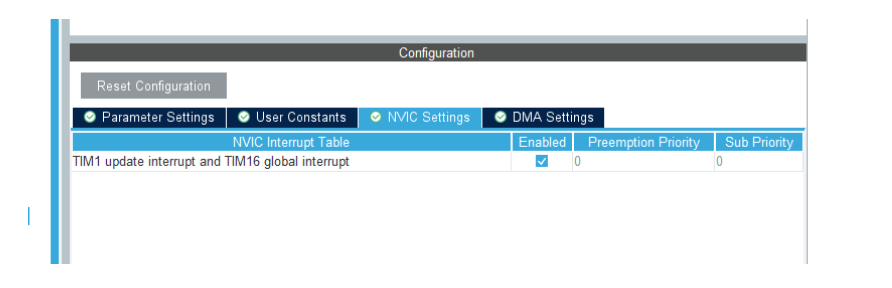
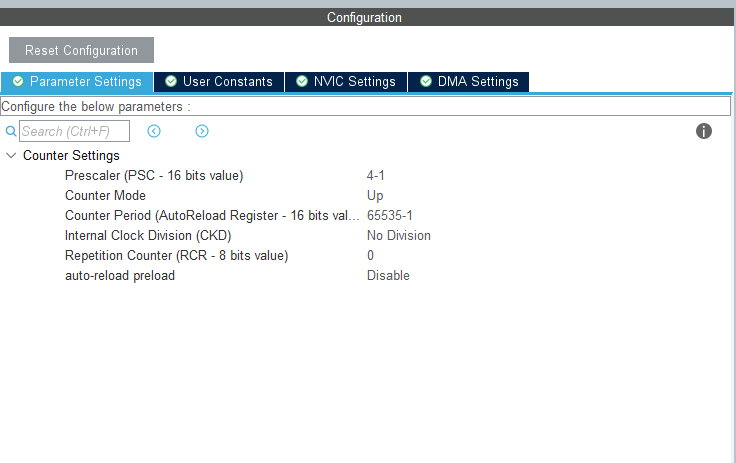
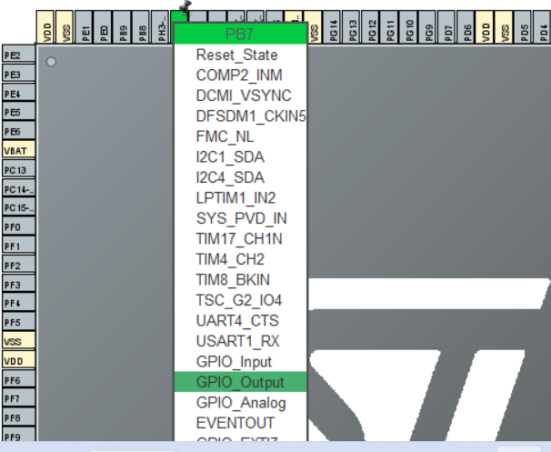

None selected 

Skip to content
Using Gmail with screen readers
in:sent 
Conversations
0.01 GB of 15 GB used
Terms · Privacy · Program Policies
Last account activity: 0 minutes ago
Currently being used in 1 other location · Details
# CALCULATION OF EXECUTION TIME IN TIMER

## Introduction  
1. General description about `Timer`.  
2. Generate a code for Timer using `STM32CubeMX` to generate a delay.  
3. Test the timer by toggling led.
4. Test the timer by sending the message through `UART`.

## 1. General description about `Timer`

In this tutoral, we configure the STM32 timer module to operate in timer mode and count the clock pulses in order to `toggle the LED`/Send the data through `UART` at regular intervals.

### Timer: 
- A Timer Module in its most basic form is a digital logic circuit that counts up every clock cycle.
- Timer is used to track of time, periodic interrupts and PWM output etc. 
- Usually timer has a prescaler and counter. 
- Timer gets the clock frequency either from CPU (STM32L4: 40 MHZ) or any other  high or low frequency.

### Prescaler:
It divides the clock frequency according to the values assigned to it. For example the clock frequency is 4MHZ and prescaler is 4 , before feeding 4MHZ clock frequency to the counter the presclaer divides 4MHZ by 4. So 1MHZ is fed to the counter.
### Counter:
 Counter counts the clock frequency pulses. For example if 4MHZ frequency clock pulses is given to a counter, it counts 4MHZ  pulses in 1 second. The maximum value a counter counts depends upon the timer we use . For example if we use a 16 bit timer then (2 ^ 16 -1), that is 65,535 is the maximum count a counter can count. If the count exceeds more than this value then it roll over back to 0.

### Block diagram of Timer:



In this example 4MHz clock frequency is given to a prescaler of 4, then 1MHZ clock pulse is fed to the counter. The time in seconds is calculated as `T = 1 / f`.

```
Time in seconds = 1 /1* 10^6 seconds = 10 microseconds.
```

So the time taken to count 1 clock pulse is 10 microseconds. So the maximum time taken to calculate the whole clock pulse is ` 65,536 * 10 ^ -6` seconds.

### STM32 TIMERS

STM32 has several built-in timers. They are numbered from TIM1 to TIM20 as shown in the following figure.

From the datasheet we can know what timer we can use.



## 2. Generate a code for Timer using `STM32CubeMX`.  

Here we can use any timer, So we choose `TIM16` as a basic timer.   
Open the `STM32CubeMx`, In the left side there is a option `Timers`, click that select `TIM16`.



Then enable the  NVIC Settings.



Now we have to set the parameter settings. Since the maximum clock frequency is 4MHZ. we set prescaler used is 4000, 

```
Time in seconds =  4MHz/4000 = 10 000 Hz.
```
Now, counter value is incremented by for every 4000 clock pulse, so there is one second delay is generated when the counter value is 10000.



### Configure the UART 

We configure `UART` in order to test the timer and make sure that a data is send through UART at regular timer intervals.

Please follow [[this tutorial]](https://github.com/harrinriza1993/STM32/tree/main/Tutorial_3_UART) to configure the `UART`

### Configure the LED 

We configure `LED` in order to test the timer and make sure that the led is toggled at regular timer intervals.

Here we are using internal led for toggling. So the pin `PB7` is used as the output pin.   
We have to configure `PB7` pin as `GPIO_OUTPUT` in `STM32CubeMX` as shown in the following figure. 



Now we have configured the `Timer`, `UART` and `LED`.
Save and generate a code.

The following functions are used for timer.

```c
// To initialize Timer16.
MX_TIM16_Init();

//Start the counter
HAL_TIM_Base_Start(&htim16);

// Set the counter value.
__HAL_TIM_SET_COUNTER(&htim16, 0);

// Get the current counter value.
timer_val = __HAL_TIM_GET_COUNTER(&htim16);
```
     
## 3. Test the timer by toggling led/UART.

Modify the `main.c` as bellow,


```c

// Timer initialization
MX_TIM16_Init()

// Start the timer
HAL_TIM_Base_Start(&htim16);

// Rest the counter
 __HAL_TIM_SET_COUNTER(&htim16, 0);

 unit32_t timer_val = 0;
 
 while(1) {

    timer_val = __HAL_TIM_GET_COUNTER(&htim16);

    // When the counter value is reached more 60000, there is a second delay is generated.
    if(timer_val >= 10000)
    {
        HAL_GPIO_TogglePin(GPIOB, GPIO_PIN_7);
        __HAL_TIM_SET_COUNTER(&htim16, 0);
    }
}
```


    

README.md
Displaying README.md.