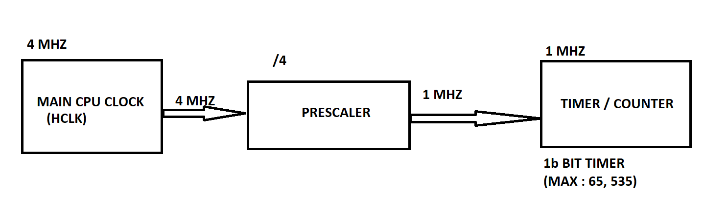
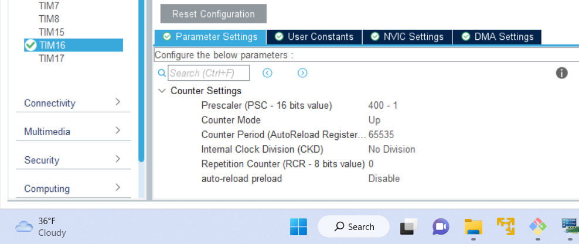

# CALCULATION OF EXECUTION TIME IN TIMER

## Introduction  
1. General description about `Timer`.  
2. Generate a code for Timer using `STM32CubeMX`.  
3. Calculation of `execution time`.
4. Create a `delay` using timer. 

## Timer : 
Timer is used to generate  delay in clock pulse. Usually timer has a prescaler and counter. It gets the clock frequency either from CPU(80 MHZ) or any other  high or low frequency.
### Prescaler :
It divides the clock frequency according to the values assigned to it. For example the clock frequency is 4MHZ and prescaler is 4 , before feeding 4MHZ clock frequency to the counter the presclaer divides 4MHZ by 4. So 1MHZ is fed to the counter. 
### Counter:
 Counter counts the clock frequency pulses. For example if 4MHZ frequency clock pulses is given to a counter, it counts 4MHZ  pulses in 1 second. The maximum value a counter counts depends upon the timer we use . For example if we use a 16 bit timer then (2 ^ 16 -1), that is 65,535 is the maximum count a counter can count. If the count exceeds more than this value then it roll over back to 0.

### Block diagram of Timer :



In this example 4MHZ clock frequency is given  to a prescaler of 4, then 1MHZ clock pulse is fed to the counter. The time in seconds is calculated as T = 1 / f.

'''
    Time in seconds = 1 /1* 10^6 seconds = 10 microseconds.
'''                 
So the time taken to count 1 clockpulse is 10 microseconds. So the maximum time taken to calculate the whole clock pulse is 65,536 * 10 ^ -6 seconds.

## CALCULATION OF EXECUTION TIME
It is the time difference between the clock pulses at certain interval. To calculate execution time we are using stm32cubemax software. Open the software by selecting stm32l4r5zi nucleo board. From the datasheet we can know what timer we can use.

Here we can use any timer, So we can choose TIM16 a basic timer. Once the cubemax page is opened In the left side there is a option Timers, click that select TIM16.

Then enable the  NVIC Settings.

Then we have to set the parameter settings. Since the maximum clock frequency is  4MHZ the prescaler used is 3(it counts from 0). Counter period is the the total count(2^16 - 1) and other parameters are left by default values.


Here UART is also used to see the elapsed time in putty. So Tx pin is PC12 is used as UART_TX.


Then we have to save and  generate code. Then open main.c , in main.c we measure the time taken to execute the HAL_Delay(2) function.
There are 3 functions first initialization
MX_TIM16_Init();
It initializes Timer16.

2. Start the counter
HAL_TIM_Base_Start(&htim16);

3. Set and get values and setting delay.
__HAL_TIM_SET_COUNTER(&htim16, 0);
HAL_Delay(2);
timer_val = __HAL_TIM_GET_COUNTER(&htim16);

See the elapsed time can be seen in putty using UART
uart_buf_len = sprintf(uart_buf, "%u us\r\n", timer_val);
HAL_UART_Transmit(&huart5, (uint8_t *)uart_buf, uart_buf_len, 100);

     
## CREATE A  DELAY  USING TIMER  
Usually HAL_Delay function is used to create delay but in this example to blink a led we are using timer functions. Here we are using internal led for blinking. So the pin B7 is used as the output pin. We have to configure PB7 pin as GPIO_Output in cubemax. Then save the program and generate the code.


As usual it has 3 main function, first one is for initialization
MX_TIM16_Init()

Second function is to start the count
HAL_TIM_Base_Start(&htim16);

Next function is to read the count value. If the count value is greater than or equal to 60000 the max led on and off using toggle function. Then again set the counter value to 0. It goes on like that in while loop.
timer_val = __HAL_TIM_GET_COUNTER(&htim16) ;

```c
if(timer_val >= 60000)
{
    HAL_GPIO_TogglePin(GPIOB, GPIO_PIN_7);
    __HAL_TIM_SET_COUNTER(&htim16, 0);
}
```


    

