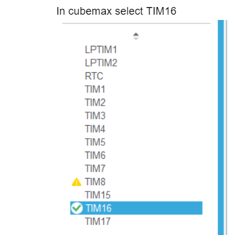
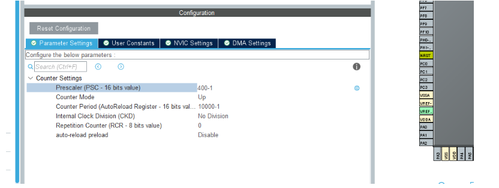
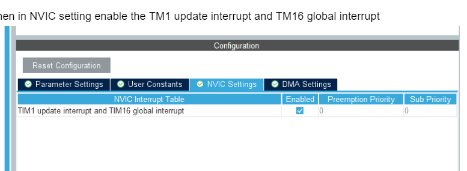
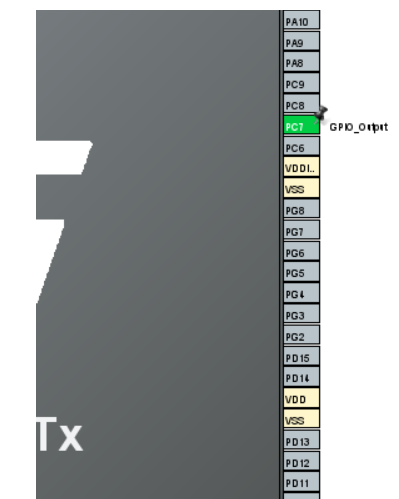
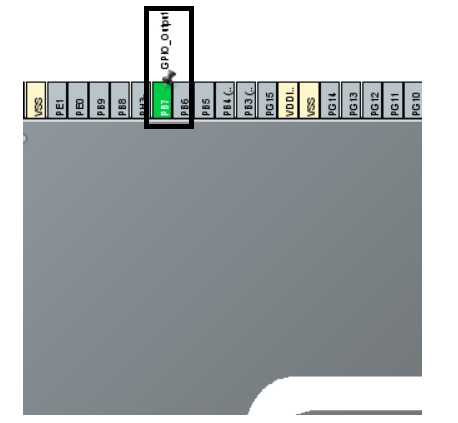
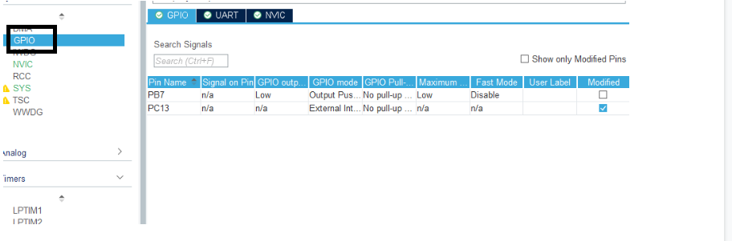
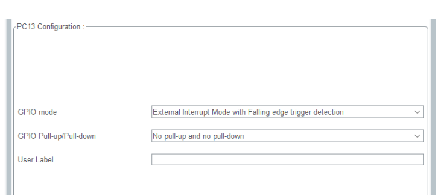
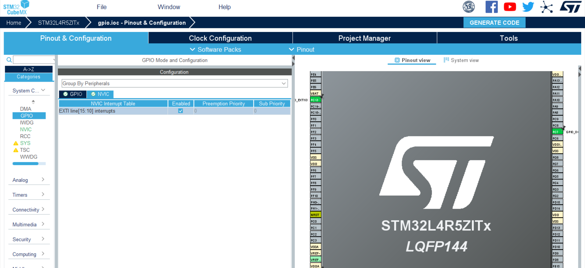

# INTERRUPT

## Introduction  

1. General description about `INTERRUPT`.  
2. Generate a code for `TIMER INTERRUPT` using `STM32CubeMX`.  
3. Test the timer interrupt by toggling led for every second.
4. Generate a code for `GPIO INTERRUPT` using `STM32CubeMX`.  
4. Test the GPIO interrupt on the rising, falling or both edges.

## 1. General description about `INTERRUPT`

An interrupt is a signal or evernt that is generated by hardware or software. When the interrupt occurs, the microcontroller stops the current program and starts to execute the another program immediately which is stored in ISR.

### How does it works

- When the interrupt occurs, the microcontroller stops the currently running instruction and saves the address of the next instruction on the Program counter (on the stack).
- Then it jumps to the memory location of the interrupt vector table that holds the address of the ISR (Interrupt Service Routine).
- Then it jumps to the ISR and starts to excute the interrupt service routine.
- Once its completed to running the instrction in the ISR, then it jumps to the program counter where it suspended the main program and continue to execute the main program.

## GENERATE A CODE FOR `TIMER INTERRUPT` USING `STM32CubeMX`.

- Open STM32CUBEMX software. In TIMERS select `TIM16`.



- The idea is to generate a interrupt for every one seconds. Our processor speed is 4MHz and we set the prescalar as 400 (400-1 it starts to count from 0). 

```
counter value = 4MHz/400 = 10000 Hz
```

which means that whenever the counter value is reached to 10000, there is an interrupt is generated. Please configure the parameter as shown in the following figure.



- Then, In the NVIC setting enable the TM1 update interrupt and TM16 global interrupt.



- Configure the `PC7` as gpio output to toggle the led from isr.



- Save and Generate the code.

## Test the timer interrupt by toggling the led

In this example, The timer interrput is generated for every seconds.
Led is toggled for every second.

```C
// To Intialize the GPIO
MX_GPIO_Init();

// To initialize the timer
MX_TIM16_Init();

// To start the timer interupt
HAL_TIM_Base_Start_IT(&htim16)

// This Callback function is trigged when the timer couneter value reach at 10,000
void HAL_TIM_PeriodElapsedCallback(TIM_HandleTypeDef *htim)
{
  // Check which version of the timer triggered this callback and toggle LED
  if (htim == &htim16 )
  {
    // Toggle the led
    HAL_GPIO_TogglePin(GPIOC, GPIO_PIN_7);
  }
}
```

## GENERATE A CODE FOR `GPIO INTERRUPT`USING `STM32CubeMX`

- Open STM32cubeMX software and set the onboard switch `PC13` as input interrupt pin.


- Toggle the onboard led `PB7` when interrupt occurs. 



- In left side of cubemax select GPIO. The input interrupt pin and output interrupt pin is shown.



- Click PC13 and set the GPIO mode either `External Interrupt with Falling edge trigger detection`.  



- Click NVIC, enable the EXIT line[15 : 10] interrupts.



- Generate the source code.

### Test that the GPIO interrupt by toggling the led

We configure the input pin as an interrupt on falling edge.

- Make sure that the input pin is configure as interrupt

```C
  /*Configure GPIO pin : PC13 */
  GPIO_InitStruct.Pin = GPIO_PIN_13;
  GPIO_InitStruct.Mode = GPIO_MODE_IT_FALLING;
  GPIO_InitStruct.Pull = GPIO_NOPULL;
  HAL_GPIO_Init(GPIOC, &GPIO_InitStruct);
```

- Override the HAL_GPIO_EXIT_Callback function in main.c
```C
// To intitalize the output pin and input pin as interrupt
MX_GPIO_Init();

/* USER CODE BEGIN 4 */
void HAL_GPIO_EXTI_Callback( uint16_t GPIO_Pin)
{
  if(GPIO_Pin == GPIO_PIN_13)
  {
     //This block will be triggered after pin activated.
     HAL_GPIO_TogglePin(GPIOB, GPIO_PIN_7);
  }
  else
  {
    //Do not do anything when else.
    __NOP();
  }
}
/* USER CODE END 4 */
```

- While releasing the user button, an interrupt is occured that will toggle the led.

- To generate an interrupt on raising edge, In `System Core` --> `GPIO` --> `GPIO Mode` --> `External Interrupt with Rising edge trigger detection`

- To generate an interrupt on both edges, In `System Core` --> `GPIO` --> `GPIO Mode` --> `External Interrupt with Rising/Falling edge trigger detection`
