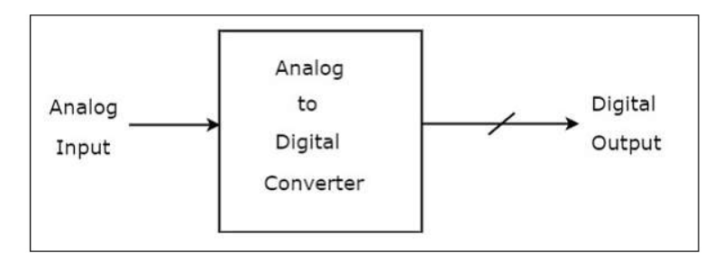
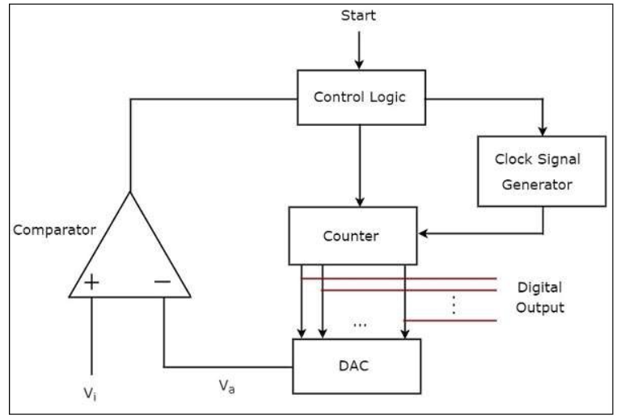
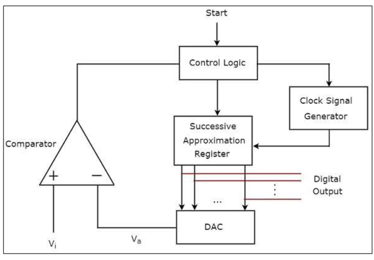
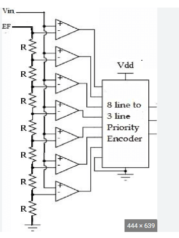
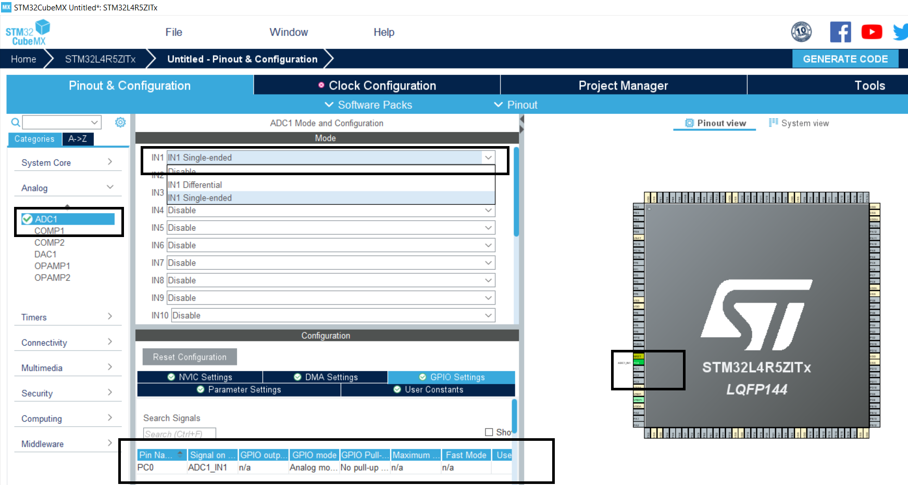
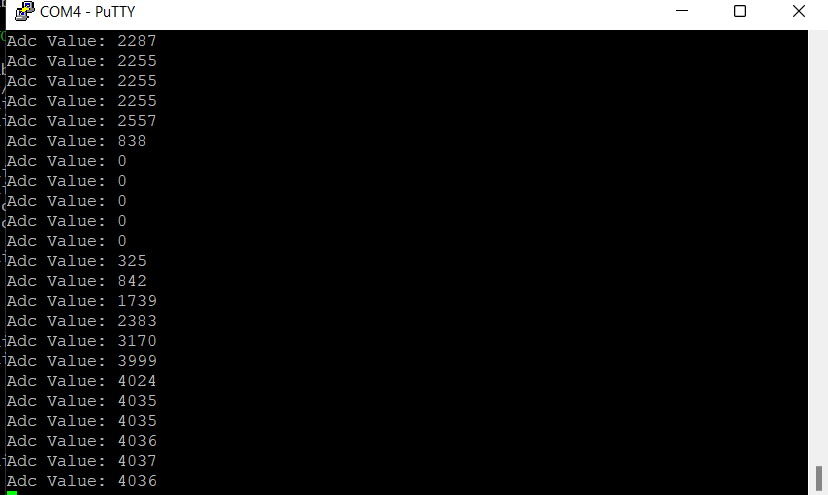
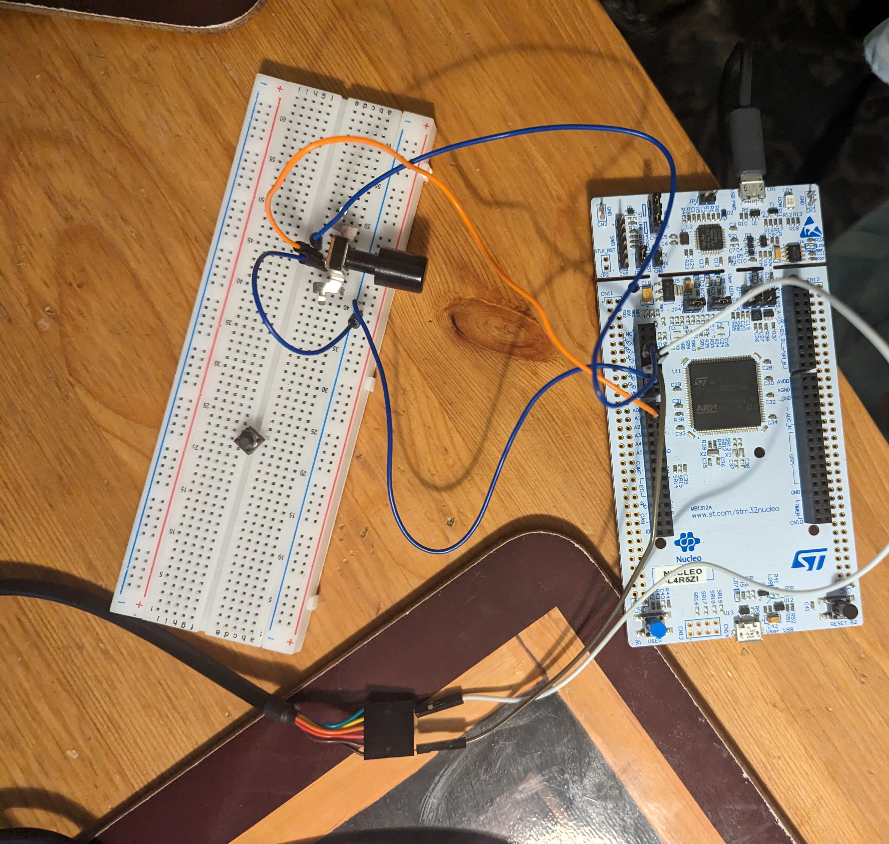

# ADC - ANALOG TO DIGITAL CONVERTER

## Introduction  

1. General description about `ADC`. 
2. General description about `ADC IN STM32`. 
3. Generate a code for `ADC` using `STM32CubeMX`.  
4. Transfer the `ADC`value in `UART` and see the value
   in ``PUTTY`.

## 1. General description about `ADC`

- ADC is an electronic circuit that takes analog value as input and convert in to digital signal.
- It samples the given input signal and performs quantization and we will get the desired digital
  output signal.



### TYPES OF `ADC`
- There are two types of ADC, they are Direct type ADC and Indirect type ADC.
- If the ADC converts the analog signal to digital signal directly by using the generated binary code it is known as 
  Direct type ADC.
- If the ADC converts the analog signal to a linear function of time and then to a digital signal, it is known as '
  Indirect type ADC.
- There are three types of Direct type ADC,they are as follows.
- Counter type ADC : Counter type ADc produces digital output by internal counter operation.
- Sucessive approximation ADC: It produces digital output by sucessive approximation technique.
- Flash type ADC : It converts analog to digital output with no time. It is the fastest type ADC.

### WORKING OF `ADC`

#### COUNTER TYPE ADC
- The counter type ADc has mainly 5 blocks, they are control logic, counter, DAC, clock signal generator
  and comparator.
- once the analog signal is given to control logic, it resets the counter and enable the clock signal in order
  to send to counter.
- Counter counts the clock pulses and the value will be in binary format. The output of counter is given to DAC.
- DAC converts the digital signal in to analog signal.
- Comparator compares the external input analog signal(vi) and analog signal from DAC(va). The output of comparator is 
  1 if vi is greater than va and the above two steps will be continued as long as the control logic receives 1 from output of the
  comparator. If vi is less than va, then output of the comparator is 0, then control logic disables the clock signal.
- At this time the output of the counter is the digital output, which is almost equal to the internal input voltage(vi).



#### SUCESSIVE APPROXIMATION ADC
- It's working is almost similar to counter type except instead of counter it uses sucessive Approximation Register(SAR).



### FLASH TYPE ADC
- The 3-bit flash type ADC has voltage divider network, 7 comparators and priority encoder.
- The voltage divider contains 8 equal resistors, a reference voltage is applied across the entire network and the voltage drop 
  across each resistor is integral multiple of 8.
- The input voltage vi is applied to non inverting terminal of all comparators. The voltage drop across the terminal is applied to
  inverting terminal of comparators from bottom to top.
- The comparators compares both the votlages(input voltage(vi), voltage drop present at respective input termina(va)). 
  If vi is greater than va the output of comparator is 1, otherwise it is 0.
- The output of all comparators are connected to priority encoder. If the output of comparator is 1, the priority encoder produces a 
  digital output.



## General description about `ADC IN STM32`
- We use successive approximation type ADC in STM32. We use single channel, in which only one potentiometer is connected.
- There are four modes of operation in STM32 ADC. They are as follows
- Single conversion mode : ADC does one conversion and then stops.
- Continous conversion mode : ADC starts another conversion as soon as one conversion is finished. It is more efficient than
  Single conversion mode.
- Scan mode : This mode is used to scan a group of analog signals. This mode is automatically selected if we are doing conversion 
  in more than one channel.
- Discontionous mode : It is used to convert a short sequence of conversations.
- STM32 ADC Formulas
        ```
        ADC Conversion Time

        Tconv = Sampling time + 12.5 cycles

        ADC Sampling Rate

        SamplingRate = 1 / Tconv

        ADC Result Voltage (Analog Input Value)

        Vin = ADC_Res x (Reference Voltage / 4096)

        Where Reference Voltage = (VREF+) – (VREF-)
        ```
- There are different ways to read STM32ADC. They are Polling method, Interrupt method and DMA method.
- Polling Method : It is the easiest method for analog to digital conversion using ADC on a input channel.
  But it is not the efficient way since it block the usage of ADC before conversion.
- Interrupt Method : It is an efficient way to do conversion since it is non blocking, So that cpu can resume execute main code
  before the conversion finishes.
- DMA Method : It is most efficient method since it uses multiple channels for conversion and there is no blocking. It is the most 
  time saving technique.

## Generate a code for `ADC` using `STM32CubeMXI
- Here we are using Polling method for conversion.
- Open STM32CUBEMX. In left side select Analog --> ADC1.
- In mode in IN1 select IN1 Single-ended. Automatically PC0 is selected in ADC1_IN1 mode.



- Generate the code.
- The functions used in code are 
```
    HAL_ADC_Start(ADC_HandleTypeDef *hadc) - Start the ADC.
    HAL_ADC_PollForConversion(ADC_HandleTypeDef *hadc, uint32_t Timeout) - Poll for conversion.
    HAL_ADC_GetValue(ADC_HandleTypeDef *hadc) - Get the ADC value.
    HAL_ADC_Stop(ADC_HandleTypeDef *hadc) - Stop ADC.
```
- The code for ADC using Pollforconverion method is as follows
```C
  HAL_ADC_Start(&hadc1);
  HAL_ADC_PollForConversion(&hadc1, 200);
  HAL_ADC_Stop(&hadc1);
  value = HAL_ADC_GetValue(&hadc1);
```
## Transfer the `ADC`value in `UART` and see the value in `PUTTY`
- The converted values should be displayed using UART in putty.
- The code to transfer the data in UART is 
```C
  // Convert the integer value in to string.
  sprintf(str, "Adc Value: %d\n ", value);
  HAL_UART_Transmit(&huart5, &str, sizeof(str)+2, 100);
```
- The ADC value is displayed in putty as follows.




- The connection of ADC in STM32 nucleo board with UART is shown in following figure.




 


