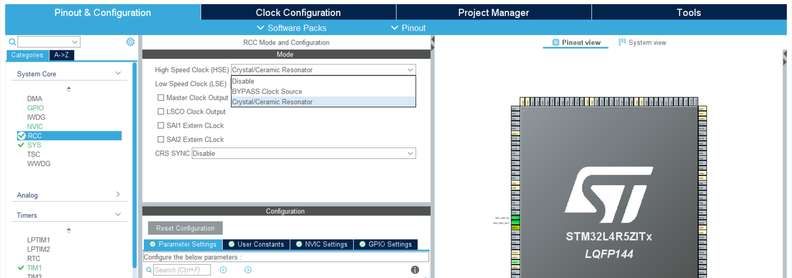
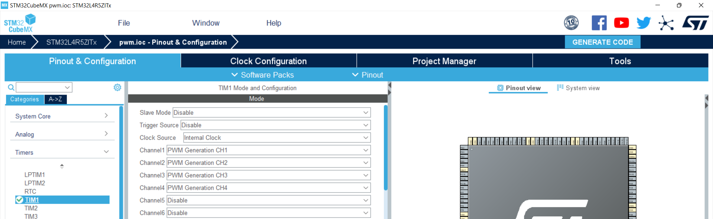
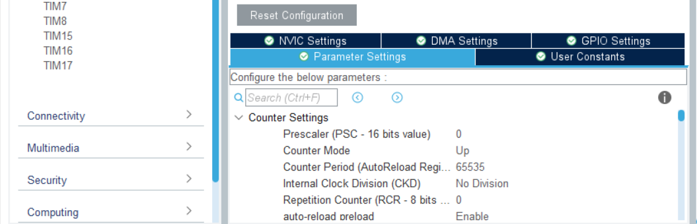

## Introduction  
1. General description about `PWM`.  
2. Generate a code for Timer using `PWM`.  
3. Test the PWM by dimming a led.

## 1. General description about `PWM`

In this tutioral, we configure the STM32 timer module to operate in PWM mode to generate STM32 PWM signal.

### PWM: 
- To control analog circuits with digital output from microcontroller, that means it is used for generating an analog signal with      digital circuits. 
- By cycling the digital signal on and off at high rates we can make a digital signal in to a analog signal.
- It is one of the most important feature in timer.
- It has two important components, they are duty cycle and frequency.
- Duty cycle is, when a signal takes to complete one cycle, the amount of time the cycle in high state is described in percentage 
  of total time.
- Frequency describes how fast the PWM completes one cycle, that means how fast it switches between from HIGH to LOW state.

### Timing Diagram of PWM:
- The frequency of the PWM is determined by internal clock, prescaler and ARRx register(Auto reload register).
- The Duty cycle is defined by the CCRx register(Capture/Compare Register).
- When the timer gets clocked from the internal source, it starts counting till the auto register value and the output channel
  remains high until the counter reaches CCRx value.
- Once the counter reaches CCRx value then the output channel is driven low and it remains until the timer counts up to the 
  auto register reload value and so on.
- The following timing diagram will show how ARR register value affects frequency of PWM signal and CCR register value affects
  duty cycle of the signal.
- For example, if we have ARR register value is 100 , CCR1 register value is 70 and CCR2 register value is 30, the clock signal is 
  automatically generated and it will start counting till the ARR register value and both the output channel signal remains high 
  until they both reach their respective CCR register value.
- So the output channel1 will be low when count is 70 and the output channel2 will be low when the count is 30.

## Generate a code for Timer using `PWM`.
- Open STM32CUBEMX and select System Core-->RCC-->High Speed Clock-->Crystal/Ceramic Resonator.

- In Timers select TIM1, in TIM1 select PWM Generation CH1 in Channel1 and similarly select PWM Generation CH2, PWM Generation CH3,
  PWM Generation CH4 from Channel2, Channel3 and Channel4 respectively.
  
- Set the Counter period to 65535 and enable auto-reload preload.
 
- Generate the code.
- The function used in PWM are as follows.

 MX_TIM1_Init() - It initiliazes the Timer.
 
 HAL_TIM_PWM_Start(TIM_HandleTypeDef *htim, uint32_t Channel) - function used to start the PWM.

- The PWM code is as follows,
'''
while (1)
  {
    /* USER CODE END WHILE */

    /* USER CODE BEGIN 3 */

// Setting CCR value from low to high.
  for(int i = 0; i <= 65530; i = i + 10000)
  {
      TIM1->CCR1 = i;
      TIM1->CCR2 = i;
      TIM1->CCR3 = i;
      TIM1->CCR4 = i;
      HAL_Delay(1000); 
  }

// Setting CCR value from high to low.
   for(int i = 60000; i >= 0; i = i - 10000)
   {
      TIM1->CCR1 = i;
      TIM1->CCR2 = i;
      TIM1->CCR3 = i;
      TIM1->CCR4 = i;
      HAL_Delay(1000);  
   }
} `

## Test the PWM by dimming a led
- Connect all the output pins with led and build the code.
- All the led will start dimming from low to high and from high to low.
 

