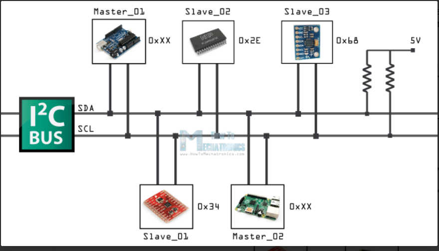
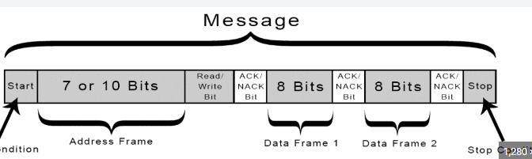
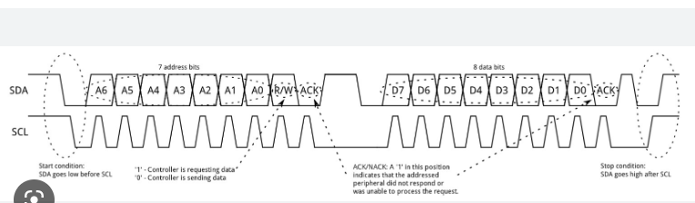
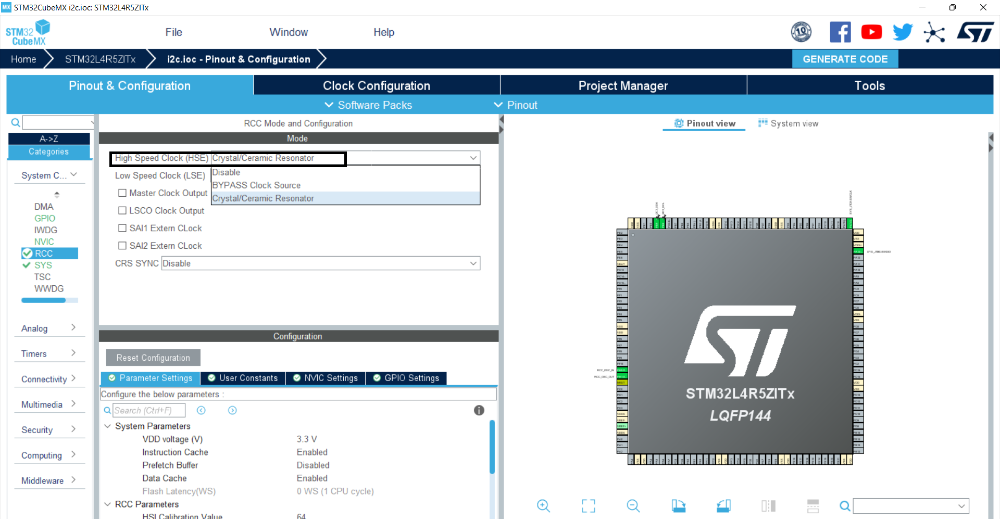
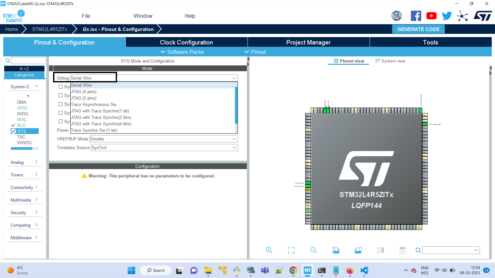
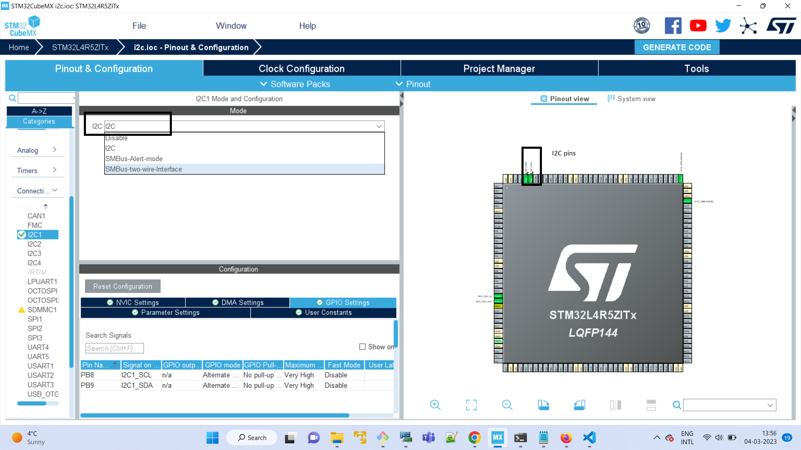

## Introduction  
1. General description about `I2C`.  
2. Generate a code for `I2C` using `CUBEMX`.
3. Implement the `I2c` connection with `LCD`.  


## 1. General description about `I2C`

In this tutoral, we will implement a I2C connection between a `LCD` and `STM32L4R5ZI Nucleo board` using `CUBEMAX`.

### I2C: 
- I2C stands for Inter-Integrated-Circuit, which act as an interface between microcontroller and serial I2C bus.
- It is a 2 wire serial, half duplex, synchrnious communication protocol.
- Two line connections are there in I2c , they are Serial Data line(SDA) and Serial Clock Line(SCL).
- It can operate at both 5v and 3.3v.
- Every Device connected in this device will have a unique address.
- It can support up to 127 devices in 8 bit address or 1023 devices in 10 bit address.

### I2C Working:
- In I2C we have master and slave devices.
- There is one master and multiple slaves, the master can communicate with a single slave or multiple slaves.
- Data transfer is only controlled by master.
- The SDA line and SCL line of master is connected with respective SCL and SDA line of all slaves in the device.
-  The ground pin of master is connected commonly with all slaves.
- There is a pull up resistor in SDA and SCL line for better communication.
- The master will have a 8 bit address or 10 bit address. It sends the address to the slaves.
- The slave which has the same address as master is activated, if two slaves has the same address then two slave devices
  are activated.
- Then the master only decided=s weather to send data or to receive data by R/W pin. If R/W pin is 0 then master will send
  data and if R/W pin is 1 then master will receive data from slave.



#### I2C FRAME:
- The first bit start indicates the starting of the communication, it initiates the data transfer(if the adress of master matches      with slave).
- The address frame will have 8 bit adddress or 10 bit address of master. The address is send bit by bit and it searches the matching 
slave address. If the slave adress is matched then data can be send or received by the master.
- The next bit is R/W (Read/Write bit). If R/W bit is 0 then data will be send by the master and if R/W is 1 then data will be received by the master from slave.
- If the data is received or send successfully then ACK bit will acknowledged, otherwise NACk bit is acknowledged.
- Once the address matches then data can be send or received by the master. Data will be also in 8 bits, all bits are send one by one.
- If the data send or received properly then ACK bit is acknowledged, else NACK bit is acknowledged.
- Similarly we can send all data from master to slave and salve to master.
- This will continues until the stop bit is initiliazed. Stop bit will terminate the communication.



#### I2C Timing Diagram:
- By default both SCL and SDA lines are high. When the address from the master is need to be send then SDA line will go from high to low.
- After SDA line goes from high to low, SCL line will go from high to low.
- Then address bit is send bit by bit which is represented in SDA pin, address bit can be either high or low. 
- Whenever an adress bit is send in SDA line, a clock pulse is generated in SCL line.
- Once the address is sent, if the SDA line goes from high to low or low to high then the data is send or received successfully.
Therefore ACK will be acknowledged.
- There will be time gap for data transfer and then data is send bit by bit. 
- If data can be send successfully then ack will be acknoeledged.
- And it goes on until the SDA pin goes from low to high.
- Once the SDA pin goes from low to high, the SCL pin also goes from low to high indicating that the communication is stopped.



## Generate a code for `I2C` using `CUBEMX`:
- Open STM32CUBEMX, in System C, in RCC select Crystal/Ceramic Resonator from High Speed Clock.



- In SYS, select Serial Wire.



- In Connectivity select I2C1, in I2C select I2C, then automatically The I2C1 pins are selected in the pin digram.



- Generate the code.
- I2C connection is between LCD and STML4R5ZI nucleo board. STML4R5ZI nucleo board will act as a master and LCD will be slave.
- The program for i2c_lcd is 

```C
#include "lcd.h"
#include "main.h"
 extern I2C_HandleTypeDef hi2c1;
#define SLAVE_ADDRESS_LCD 0x4E

void lcd_send_cmd (char cmd)
{
  char data_u, data_l;
	uint8_t data_t[4];
	data_u = (cmd&0xf0);
	data_l = ((cmd<<4)&0xf0);
	data_t[0] = data_u|0x0C;  //en=1, rs=0
	data_t[1] = data_u|0x08;  //en=0, rs=0
	data_t[2] = data_l|0x0C;  //en=1, rs=0
	data_t[3] = data_l|0x08;  //en=0, rs=0
	HAL_I2C_Master_Transmit (&hi2c1, SLAVE_ADDRESS_LCD,(uint8_t *) data_t, 4, 100);
}
void lcd_send_data (char data)
{
	char data_u, data_l;
	uint8_t data_t[4];
	data_u = (data&0xf0);
	data_l = ((data<<4)&0xf0);
	data_t[0] = data_u|0x0D;  //en=1, rs=1
	data_t[1] = data_u|0x09;  //en=0, rs=1
	data_t[2] = data_l|0x0D;  //en=1, rs=1
	data_t[3] = data_l|0x09;  //en=0, rs=1
	HAL_I2C_Master_Transmit (&hi2c1, SLAVE_ADDRESS_LCD,(uint8_t *) data_t, 4, 100);
}

void lcd_init (void)
{
	// 4 bit initialisation
	HAL_Delay(50);  // wait for >40ms
	lcd_send_cmd (0x30);
	HAL_Delay(5);  // wait for >4.1ms
	lcd_send_cmd (0x30);
	HAL_Delay(1);  // wait for >100us
	lcd_send_cmd (0x30);
	HAL_Delay(10);
	lcd_send_cmd (0x20);  // 4bit mode
	HAL_Delay(10);

  // dislay initialisation
	lcd_send_cmd (0x28); // Function set --> DL=0 (4 bit mode), N = 1 (2 line display) F = 0 (5x8 characters)
	HAL_Delay(1);
	lcd_send_cmd (0x08); //Display on/off control --> D=0,C=0, B=0  ---> display off
	HAL_Delay(100);
	lcd_send_cmd (0x01);  // clear display
	HAL_Delay(1);
	HAL_Delay(1);
	lcd_send_cmd (0x06); //Entry mode set --> I/D = 1 (increment cursor) & S = 0 (no shift)
	HAL_Delay(1);
	lcd_send_cmd (0x0C); //Display on/off control --> D = 1, C and B = 0. (Cursor and blink, last two bits)
}

void lcd_send_string (char *str, int line_selection)
{
 if(line_selection == 1)
  {
    lcd_send_cmd(0x80);
  }
  else if(line_selection == 2)
  {
    lcd_send_cmd(0xC0);
  }
	while (*str) lcd_send_data (*str++);
}

void lcd_put_cur(int row, int col)
{
	switch(row)
	{
		case 0 :
			col  |= 0x80;
			break;
		case  1:
			col |= 0x10;
			break;

	}
}

```
```C
- In main.c the function used are
  MX_GPIO_Init() - For initializing the GPIO pins.
  MX_I2C1_Init() - Initializing the I2C pin.
  lcd_init() - Initiliaze the lcd.
  lcd_send_string("HARRIN", 1) - The data to be printed in first line of the lcd.
  lcd_put_cur(2, 0) - Pointing the cursor at second row.
  lcd_send_string("RIZA", 2) - The data to be printed in second line of the lcd.
  ```
  ## Implement the `I2c` connection with `LCD`:
  - LCD has four pins. The ground pin , VCC, SDA and SCL.
  - The ground pin of LCD should be connected with ground pin of STM32 nucleo board.
  - The VCC pin of LCD can be connected with either 5v 0r 3.3v.
  - The SDA and SCL pin of LCD are connected with respective SDA and SCL pin of nucleo board.
  - When we connect the device and run the code, we will get output as below

  


